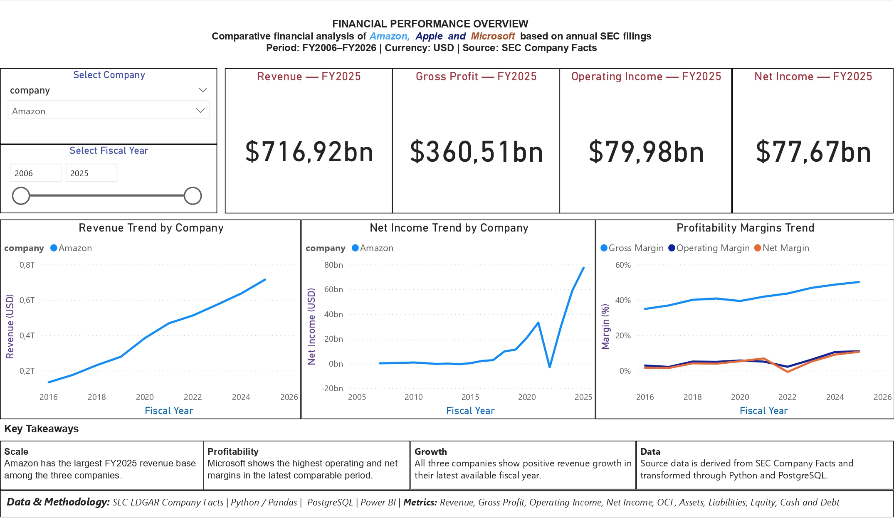

# Financial BI Analysis — Apple, Microsoft & Amazon

End-to-end financial analytics project built on **real public SEC financial data**.

This project demonstrates the transition from traditional business analysis and BI toward **analytics engineering** by combining:

**Python → PostgreSQL → SQL data modelling → KPI layer → Power BI**

The focus is not only on the final dashboard, but on building a reproducible analytical data pipeline from raw external data to a BI-ready dataset.

---

## Project Overview

The project analyzes the financial performance of:

- Apple Inc.
- Microsoft Corporation
- Amazon.com, Inc.

The source data comes directly from the **U.S. Securities and Exchange Commission (SEC) EDGAR Company Facts API**.

Unlike synthetic portfolio datasets, the project works with real company filings and therefore requires handling real-world data issues such as:

- different fiscal year-end dates
- inconsistent XBRL concepts
- different historical coverage
- missing financial concepts
- point-in-time vs. annual flow metrics
- duplicate observations
- derived financial metrics
- validation of financial calculations

---

## Architecture

```text
SEC EDGAR Company Facts API
            │
            ▼
      Python ingestion
            │
            ▼
 Data cleaning & validation
            │
            ▼
      Standardized CSV
            │
            ▼
        PostgreSQL
            │
            ▼
    staging.financials
            │
            ▼
     SQL transformation
            │
      ┌─────┴─────┐
      ▼           ▼
financials_wide  financial_kpis
      │           │
      └─────┬─────┘
            ▼
     bi_financials
            │
            ▼
         Power BI
```

---

# 1. Data Source

The project uses real financial data from:

**U.S. Securities and Exchange Commission — EDGAR Company Facts**

The Company Facts API provides structured XBRL financial information reported by publicly listed companies.

### Companies

| Company | Fiscal year end |
|---|---|
| Apple | September |
| Microsoft | June |
| Amazon | December |

Because the companies use different fiscal calendars, fiscal years are derived from the actual reporting period rather than assuming that every company follows the same calendar.

No synthetic financial data is used for the main analysis.

---

# 2. Python Data Ingestion

Python is used as the ingestion and transformation layer.

The scripts:

1. download SEC Company Facts JSON data
2. inspect available XBRL concepts
3. identify suitable financial concepts
4. extract annual 10-K observations
5. distinguish flow metrics from balance-sheet metrics
6. derive fiscal years
7. remove duplicate observations
8. standardize the output schema
9. validate the resulting datasets
10. save analytical CSV files

### Main financial metrics

The standardized datasets contain:

- Revenue
- Gross Profit
- Operating Income
- Net Income
- Operating Cash Flow
- Assets
- Liabilities
- Equity
- Cash
- Long-Term Debt

---

# 3. Handling Real-World SEC/XBRL Differences

One of the main goals of the project was to avoid assuming that the same XBRL concept exists consistently for every company.

For example, Amazon does not provide a directly usable modern total `Liabilities` concept in the same way as Apple and Microsoft.

Therefore:

```text
Liabilities = Assets - Equity
```

The derived value is explicitly documented in the dataset as:

```text
Derived: Assets - Equity
```

Amazon Gross Profit is also derived because a directly usable modern Gross Profit concept was not consistently available:

```text
Gross Profit = Revenue - CostOfGoodsAndServicesSold
```

The derived value is documented as:

```text
Derived: Revenue - CostOfGoodsAndServicesSold
```

This keeps the transformation transparent and reproducible instead of silently filling missing data.

---

# 4. Data Validation

Each company dataset was validated before being loaded into PostgreSQL.

Validation includes:

- expected columns
- expected company
- expected financial metrics
- missing values in key fields
- duplicate records
- fiscal year consistency
- reporting form
- reporting period
- USD units
- annual flow metrics
- point-in-time balance-sheet metrics
- flow-period duration
- derived Gross Profit calculations
- derived Liabilities calculations
- latest fiscal-year completeness

The final datasets were validated successfully before loading into PostgreSQL.

---

# 5. PostgreSQL Data Layer

The three standardized CSV datasets are loaded into PostgreSQL.

The raw analytical data is stored in:

```text
staging.financials
```

Table structure:

```text
company
fiscal_year
metric
value
unit
period_start
period_end
period_type
form
filed
source
```

The PostgreSQL layer separates ingestion from analytical modelling.

---

# 6. SQL Analytical Layer

The project uses multiple SQL layers rather than building all calculations directly inside Power BI.

### `analytics.financials_wide`

Transforms the metric-based staging table into a company/year analytical structure.

Example:

```text
company
fiscal_year
revenue
gross_profit
operating_income
net_income
operating_cash_flow
assets
liabilities
equity
cash
long_term_debt
```

### `analytics.financial_kpis`

Calculates analytical KPIs including:

- Revenue Growth YoY
- Gross Margin
- Operating Margin
- Net Margin
- Operating Cash Flow Margin
- Debt-to-Equity
- ROA
- ROE

### `analytics.bi_financials`

Provides the final BI-ready dataset consumed by Power BI.

This separation creates a simple analytical-engineering style architecture:

```text
Staging
   ↓
Transformation
   ↓
KPI layer
   ↓
BI-ready dataset
```

---

# 7. Power BI

Power BI is used as the presentation and business-analysis layer.

The report contains two pages.

## Financial Overview

Provides a cross-company overview of:

- Revenue
- Gross Profit
- Operating Income
- Net Income
- Revenue trends
- Gross Margin
- Operating Margin
- Net Margin

Users can filter the analysis by company and fiscal year.

### Preview



---

## Company Deep Dive

Provides a detailed view of the selected company.

The page includes:

- latest fiscal-year Revenue
- Gross Profit
- Operating Income
- Net Income
- Net Margin
- Revenue trend
- profitability trends
- Gross Margin
- Operating Margin
- Net Margin
- Assets
- Liabilities
- Equity
- Cash
- Long-Term Debt
- Operating Cash Flow

The company selector allows the same analytical framework to be applied to Apple, Microsoft and Amazon.

### Preview


---

# 8. Business Questions

The analysis is designed to answer questions such as:

- How has revenue changed over time?
- How has profitability evolved?
- How have gross, operating and net margins changed?
- How does operating cash flow compare with reported profit?
- How have assets, liabilities and equity changed?
- How has long-term debt developed?
- What are the latest reported financial results?
- How do the three companies differ across major financial KPIs?

---

# 9. Technology Stack

### Data & Programming

- Python
- Pandas
- Requests

### Database

- PostgreSQL

### Analytics Engineering / SQL

- SQL
- CTEs
- Window functions
- Conditional aggregation
- KPI modelling
- Data validation
- Layered analytical views

### BI

- Microsoft Power BI
- DAX
- Data modelling
- Interactive filtering
- KPI visualization

### Development

- Git
- GitHub
- Python virtual environment

---

# 10. Repository Structure

```text
financial-bi-analysis/
│
├── README.md
│
├── data/
│   ├── apple_financials.csv
│   ├── microsoft_financials.csv
│   └── amazon_financials.csv
│
├── ingestion/
│   ├── SEC ingestion scripts
│   ├── transformation scripts
│   └── PostgreSQL loader
│
├── sql/
│   ├── 01_financials_wide.sql
│   ├── 02_financial_kpis.sql
│   └── 03_validation_checks.sql
│
├── powerbi/
│   ├── finance-bi-analysis.pbix
│   ├── financial-overview.png
│   └── company-deep-dive.png
│
└── docs/
    └── data-pipeline.png
```

---

# 11. Reproducibility

The project can be reproduced locally by following the pipeline:

```text
1. Download SEC Company Facts
        ↓
2. Run Python ingestion scripts
        ↓
3. Validate company datasets
        ↓
4. Load CSV files into PostgreSQL
        ↓
5. Create analytical SQL views
        ↓
6. Run validation checks
        ↓
7. Connect Power BI to the BI layer
```

The Power BI report is provided as a `.pbix` file for local inspection.

---

# 12. What This Project Demonstrates

This project demonstrates a shift from dashboard-focused analysis toward a more engineering-oriented analytics workflow.

Instead of:

```text
Dataset → Dashboard
```

the project follows:

```text
External data source
        ↓
Data ingestion
        ↓
Data quality & validation
        ↓
Transformation
        ↓
Database
        ↓
Analytical modelling
        ↓
KPI layer
        ↓
BI-ready data
        ↓
Dashboard
```

This is the direction I am developing toward:

**BI Analyst → Analytics Engineer → Data Engineer**

---

## Author

**Sergey Koverzen**

Financial Accounting · Data Analytics · Business Intelligence · Analytics Engineering

GitHub:  
https://github.com/SergeyKoverzen

Portfolio:  
https://github.com/SergeyKoverzen/data-analytics-portfolio
